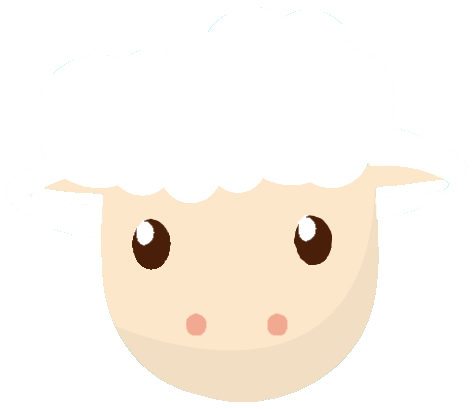

<h1 align="center">
   
  
   
  Woolbattle Plugin
   
</h1> 

<h4 align="center">fast, customizable, unique perks & things you never saw before</h4>

  
  
  

  <a href="#overview">Overview</a>
  •
  <a href="#overview">Features</a>
  •
  <a href="#license">License</a>

# Overview

Woolbattle is a Minecraft Spigot/Paper Plugin written for the version 1.8. It is a minigame, where nearly everything
costs wool - that's why it is named "Woolbattle". The maps are in the air, so the only way you can die is to fall
under a specific height, which is surprisingly customizable 😉.You have 3 items at the start: 
- a pair of shears, to farm wool and attack enemies
- a bow, to kill enemies from distance
- an ender pearl, to teleport yourself 

Additionally, there are many active and passive perks. Let's start with the active ones:

_Active Perks are normal items, that often cost wool and have cooldowns. For Example, there is a "Rescue Pod", 
which places blocks around you, to save you in the air. It costs 25 wool to use it and has a cooldown of 30 seconds, 
where you cant use it._

Passive Perks:

_The passive perks are very different, you can't actually use them, but they perform things in specific cases. For example,
give you double the wool amount when breaking one or let you jump higher._

Power-Ups:

_The Power-Ups in form of items spawn at random locations on the map - if you pick them up you will get random, good effects 
for a limited period of time._

Just try it out with your friends, it's a hilarious game: _Join the Minecraft Server with the IP:_ **mc.almanbot.de**

**Features:**

- many values are configurable by using the config.json
- exciting active and passive perks
- peerless so-called "Power-Ups", which give effects on pick-up
- inventory-sort function
- already 2 wonderful maps included - only 5 minutes to set up

# Setup

1. Setup a MongoDB Cluster

The easiest way to host one for free is using [MongoDB Atlas](https://www.mongodb.com/atlas) or 
host it local on your server.

2. Download the latest version

Download the latest woolbattle.jar from [here](https://github.com/SimsumMC/woolbattle/releases) or if you're a 
developer, download the source code and compile it yourself.

3. Get the [config.json](https://github.com/SimsumMC/woolbattle/blob/main/config.json) and fill in the values. Important:
if you are going to use a map from this plugin, you can skip this step.

4. [Optional] Install a Map

Download one Map form [here](https://github.com/SimsumMC/woolbattle/tree/main/maps). In the specific folder, you have the 
world folder, which you are going to use as a new world for your server. You also need the config.json provided with your map,
and add the mongodb connection string in the field with the name "mongodb".

6. Drop the woolbattle.jar & config.json in the plugin folder 

7. Start the server and have fun!

# License

This project uses the MIT-License. For more information click [here](https://choosealicense.com/licenses/mit/)
